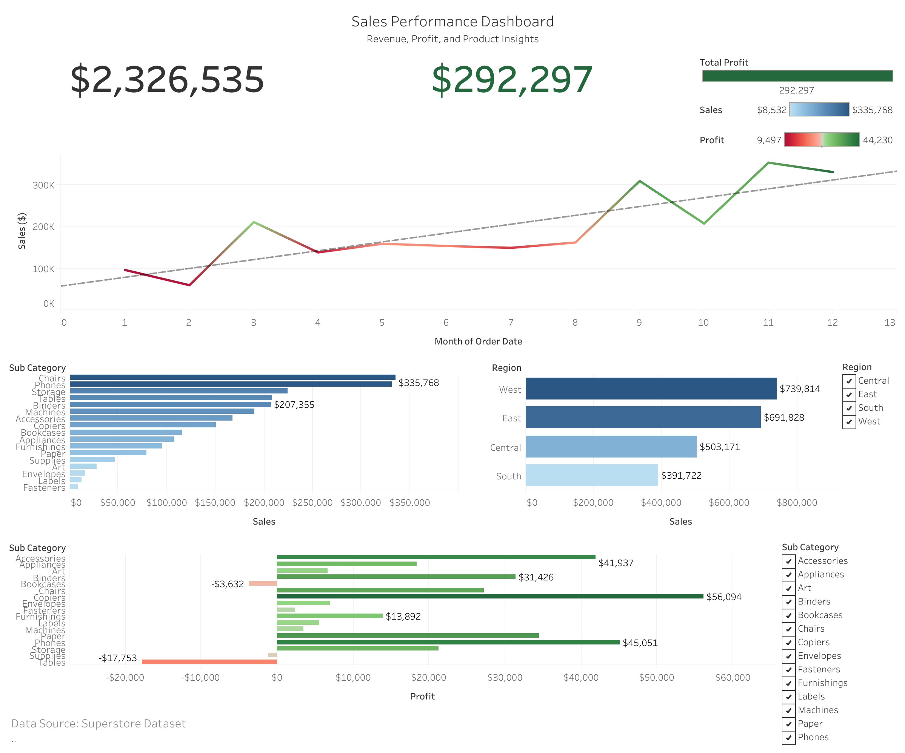

## Project Title
Sales Performance Analysis Dashboard


⸻


## Business Task
The goal of this project was to analyze sales data to identify key drivers of revenue, evaluate profitability across product categories, and uncover regional and temporal trends to support data-driven business decisions.


⸻


## Data Source
* Superstore dataset (public dataset commonly used for analysis practice)
* Data includes: orders, sales, profit, product categories, and regions


⸻


## Tools Used
* SQL (data cleaning and transformation in BigQuery)
* Spreadsheets (initial exploration and validation)
* Python (optional analysis in notebook)
* Tableau (dashboard creation)


⸻


## Data Cleaning & Preparation
* Removed null and invalid records
* Standardized column formats (dates, numeric fields)
* Created calculated fields:
    * Profit Margin = Profit / Sales
* Verified data consistency across tables


⸻


## Analysis Summary
The analysis focused on identifying trends and differences across:
* Revenue over time
* Product performance
* Regional sales distribution
* Profitability by category


⸻


## Key Insights
1. Revenue Trends
* Sales show consistent fluctuations over time, indicating seasonal demand patterns.


⸻


2. Product Performance
* A small group of top-performing products contributes a significant portion of total revenue.
* Sales are concentrated in a few high-performing sub-categories.


⸻


3. Regional Performance
* Certain regions outperform others in total revenue.
* Lower-performing regions present opportunities for targeted growth strategies.


⸻


4. Profitability
* Some categories generate strong revenue but low or negative profit.
* This suggests issues with pricing, costs, or discounting strategies.


⸻


## Dashboard Features
* KPI cards for Revenue and Profit
* Monthly revenue trend line chart
* Top 10 products by sales
* Regional sales comparison
* Profitability analysis (profit vs loss)
* Interactive filters (Region, Category)


⸻


## Recommendations
1. Focus on High-Performing Products
Invest in marketing and inventory for top-performing product categories.
2. Address Unprofitable Categories
Review pricing and cost structures for categories with negative profit.
3. Target Underperforming Regions
Develop region-specific strategies to improve sales in low-performing areas.


⸻


## Deliverables
* Tableau Dashboard (visual analysis)
* SQL queries (sql_queries.sql)
* Cleaned dataset
* Project documentation

____

## Dashboard Preview

____

## Data Cleaning file
Google Sheets: [View Cleaned Data](https://docs.google.com/spreadsheets/d/e/2PACX-1vQljVz7pCYl0cUw0s_tsSdpEzMKMR_SuSIC9NEjkYDdQi1AYS0c9e1Oeffu448WU9v1hMmvlSINCsr4/pubhtml)
